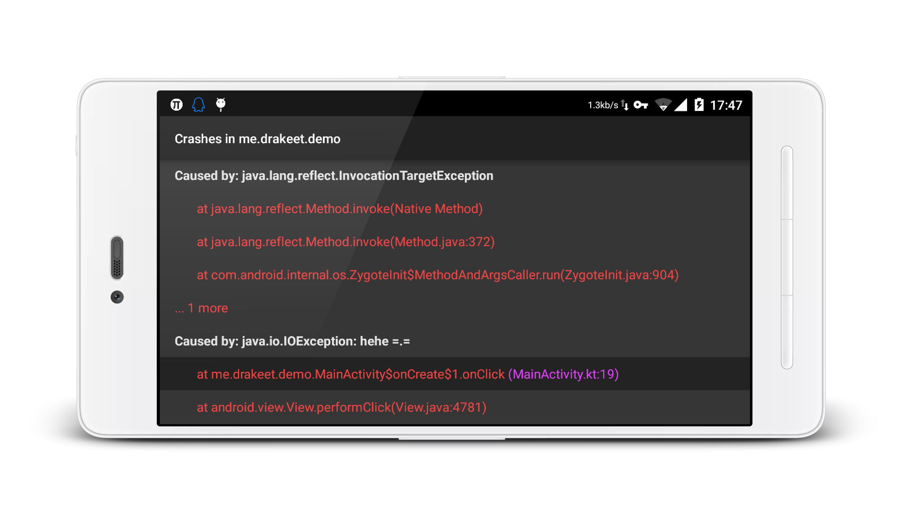

#CrashWoodpecker

An uncaught exception handler library like as Square's [LeakCanary](https://github.com/square/leakcanary).



## Getting started

In your `build.gradle`:

```gradle
dependencies {
  debugCompile 'me.drakeet.library:crashwoodpecker:0.9.1'
}
```

**NOTE 1: 上次我把`crashwoodpecker` 拼写错了, QAQ, 已经改正了!! 如果使用旧的地址, 请自行更正!!**

NOTE 2: I will add a releaseCompile to compile do nothing with the same class and package in your release build. Comming soon...

In your `Application` class:

```java
public class ExampleApplication extends Application {

  @Override public void onCreate() {
    super.onCreate();
    CrashWoodpecker.fly().to(this);
  }
}
```

**That is all!** CrashWoodpecker will automatically show an Activity when your app crash with uncaught exceptions in your debug build.

Demo apk download: https://github.com/drakeet/CrashWoodpecker/releases/download/0.9.1/LittleWood.apk

## TODO

* Save logs and to reload.

## About me

I am a student in China, I love reading pure literature, love Japanese culture and Hongkong music. At the same time, I am also obsessed with writing code. If you have any questions or want to make friends with me, you can write to me: drakeet.me@gmail.com

In addition, my blog: http://drakeet.me

If you like my open source projects, you can follow me: https://github.com/drakeet

## Thanks

Great Square: http://square.github.io

License
============

    The MIT License (MIT)

    Copyright (c) 2015 drakeet

    Permission is hereby granted, free of charge, to any person obtaining a copy
    of this software and associated documentation files (the "Software"), to deal
    in the Software without restriction, including without limitation the rights
    to use, copy, modify, merge, publish, distribute, sublicense, and/or sell
    copies of the Software, and to permit persons to whom the Software is
    furnished to do so, subject to the following conditions:

    The above copyright notice and this permission notice shall be included in all
    copies or substantial portions of the Software.

    THE SOFTWARE IS PROVIDED "AS IS", WITHOUT WARRANTY OF ANY KIND, EXPRESS OR
    IMPLIED, INCLUDING BUT NOT LIMITED TO THE WARRANTIES OF MERCHANTABILITY,
    FITNESS FOR A PARTICULAR PURPOSE AND NONINFRINGEMENT. IN NO EVENT SHALL THE
    AUTHORS OR COPYRIGHT HOLDERS BE LIABLE FOR ANY CLAIM, DAMAGES OR OTHER
    LIABILITY, WHETHER IN AN ACTION OF CONTRACT, TORT OR OTHERWISE, ARISING FROM,
    OUT OF OR IN CONNECTION WITH THE SOFTWARE OR THE USE OR OTHER DEALINGS IN THE
    SOFTWARE.
